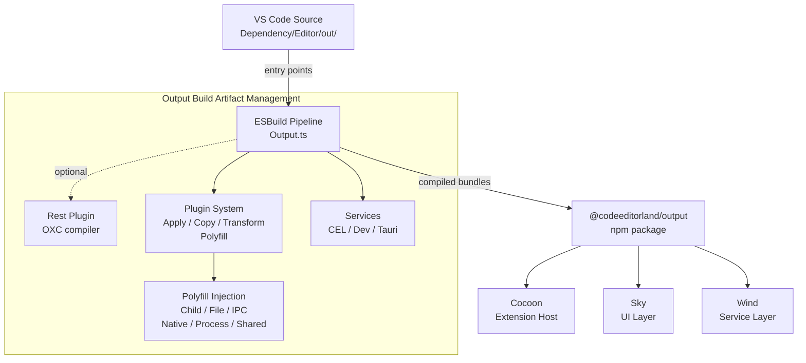

<table>
	<tr>
		<td colspan="1">
			<h3 align="center">
				<picture>
					<source media="(prefers-color-scheme: dark)" srcset="https://editor.land/Dark/Image/GitHub/Land.svg">
					<source media="(prefers-color-scheme: light)" srcset="https://editor.land/Image/GitHub/Land.svg">
					
				</picture>
			</h3>
		</td>
		<td colspan="3" valign="top"><h3 align="center">Output&#x2001;⚫</h3></td>
	</tr>
</table>

---

# **Output**&#x2001;⚫&#x2001;Architecture

`Output` is the build artifact management package for `Land`. It handles
compilation of `VS Code` platform source code through:

- Dual-compiler support (`ESBuild` primary, `Rest` OXC optional)
- Produces the `@codeeditorland/output` npm package consumed by `Cocoon`, `Sky`,
  and `Wind`

---

## Table of Contents

1. [Overview](#overview)
2. [Architecture](#architecture)
3. [Compiler Modes](#compiler-modes)
4. [Build Pipeline](#build-pipeline)
5. [Plugin System](#plugin-system)
6. [Polyfill Injection](#polyfill-injection)
7. [Output Layout](#output-layout)
8. [Related Documentation](#related-documentation)

---



## Overview&#x2001;📋

`Output` is the build orchestration layer for `Land`'s `TypeScript` assets:

- Wraps `ESBuild` with `Land`-specific transforms, plugin hooks, and polyfill
  injection
- Supports an optional `Rest` (OXC-based) compiler pipeline for faster
  `TypeScript` compilation

| Attribute    | Value                                                           |
| ------------ | --------------------------------------------------------------- |
| Language     | `TypeScript` + `JavaScript`                                     |
| Compiler     | `ESBuild` (default), `Rest` OXC (optional)                      |
| Output       | `@codeeditorland/output` npm package                            |
| Dependencies | `@codeeditorland/rest` (optional), `@playform/build`, `esbuild` |
| Consumers    | `Cocoon`, `Sky`, `Wind`                                         |

---

## Architecture&#x2001;🏗️

```
+--------------------------------------------------------------+
|                       Output                                  |
|                                                               |
|  +------------------+  +------------------+                    |
|  | ESBuild/Output.ts |  | ESBuild/Rest.ts  |                   |
|  | Default esbuild   |  | Rest plugin      |                   |
|  | pipeline          |  | (OXC compiler)   |                   |
|  +------------------+  +------------------+                    |
|                                                               |
|  +------------------+  +------------------+                    |
|  | Plugin/          |  | Polyfill/        |                    |
|  | - Apply.ts       |  | - Child/         |                    |
|  | - Copy.ts        |  | - File/          |                    |
|  | - Transform.ts   |  | - IPC/           |                    |
|  | - Index.ts       |  | - Native/        |                    |
|  | - Type.ts        |  | - Process/       |                    |
|  |                  |  | - Shared/        |                    |
|  +------------------+  +------------------+                    |
|                                                               |
|  +------------------+  +------------------+                    |
|  | Service/         |  | Asset/           |                    |
|  | - CEL/           |  | - Style/         |                    |
|  | - Dev/           |  |                  |                    |
|  | - Tauri/         |  |                  |                    |
|  +------------------+  +------------------+                    |
+--------------------------------------------------------------+
```

### Module Map&#x2001;🗺️

| Path                             | Purpose                                    |
| -------------------------------- | ------------------------------------------ |
| `Source/ESBuild/Output.ts`       | Primary ESBuild compilation pipeline       |
| `Source/ESBuild/Rest/`           | Rest OXC compiler plugin integration       |
| `Source/ESBuild/Microsoft/`      | VS Code source-specific compilation config |
| `Source/ESBuild/CodeEditorLand/` | Land-specific compilation config           |
| `Source/ESBuild/Exclude/`        | Exclude patterns for compilation           |
| `Source/Plugin/Apply.ts`         | ESBuild plugin for applying transforms     |
| `Source/Plugin/Copy/`            | Asset copying plugin                       |
| `Source/Plugin/Transform/`       | Code transform plugins                     |
| `Source/Plugin/Polyfill/`        | Polyfill injection plugins                 |
| `Source/Plugin/Index.ts`         | Plugin registry                            |
| `Source/Polyfill/Child/`         | Child process polyfills                    |
| `Source/Polyfill/File/`          | File system polyfills                      |
| `Source/Polyfill/IPC/`           | IPC polyfills                              |
| `Source/Polyfill/Native/`        | Native module polyfills                    |
| `Source/Polyfill/Process/`       | Process polyfills                          |
| `Source/Polyfill/Shared/`        | Shared polyfill utilities                  |
| `Source/Service/CEL/`            | Code Editor Land specific services         |
| `Source/Service/Dev/`            | Development-time services                  |
| `Source/Service/Tauri/`          | Tauri-specific services                    |
| `Source/Asset/Style/`            | CSS asset management                       |
| `Source/Apply/Pipeline.ts`       | Apply pipeline orchestration               |

---

## Compiler Modes&#x2001;⚡

`Output` supports two compiler backends:

### Default: ESBuild&#x2001;⚡

```
TypeScript input (.ts, .tsx)
    |
    v
ESBuild parser
    |
    v
ESBuild transforms:
    - Module resolution remapping (electron -> Tauri stubs)
    - Define substitution (process.platform, __dirname)
    - Dead code elimination
    |
    v
ESBuild codegen
    |
    v
JavaScript output
```

### Optional: Rest OXC&#x2001;⚡

Activated via `Compiler=Rest` environment variable:

```
TypeScript input (.ts, .tsx)
    |
    v
Rest (Rust OXC) parser
    |
    v
OXC transformer
    - 2-3x faster than esbuild
    - Better decorator/class field support
    |
    v
OXC codegen
    |
    v
JavaScript output
```

### Integration&#x2001;🔗

```typescript
// Output/ESBuild/Output.ts
const compiler =
	process.env.Compiler === "Rest" ? await import("./Rest/RestPlugin") : null;

const plugins = [];
if (compiler) {
	plugins.push(compiler.createPlugin());
}
// Standard ESBuild build with optional Rest plugin
```

---

## Build Pipeline&#x2001;🔧

The `Output` build pipeline processes `VS Code` platform code:

```
1. Input discovery
   - Reads from Dependency/Editor/out/ (Stage 1 compiled VS Code)
   - Identifies entry points (workbench, extHost files)

2. Module resolution
   - Remaps electron imports to Tauri stubs
   - Remaps Node.js built-in modules to polyfills
   - Resolves Land-specific module paths

3. Transform application
   - Polyfill injection (see below)
   - Source map chaining
   - Platform code markers (CEL:platform)

4. Bundle compilation
   - ESBuild compiles to single or multiple output files
   - Source maps generated for debugging

5. Output packaging
   - Produces @codeeditorland/output package
   - Versioned and cached in Output/Target/
```

---

## Plugin System&#x2001;🔌

`Output` defines a plugin interface for extending the build pipeline:

```typescript
export interface OutputPlugin {
	name: string;
	setup(build: ESBuild.PluginBuild): void;
}
```

### Built-in Plugins&#x2001;🔌

| Plugin              | Purpose                                        |
| ------------------- | ---------------------------------------------- |
| `Apply.ts`          | Applies Land-specific code transforms          |
| `Copy.ts`           | Copies static assets to output directory       |
| `Transform.ts`      | TypeScript-to-JavaScript transformation config |
| `Polyfill/Index.ts` | Polyfill injection orchestration               |
| `RestPlugin.ts`     | Rest OXC compiler integration (optional)       |

---

## Polyfill Injection&#x2001;🧩

`Output` injects polyfills during compilation for APIs that don't exist in the
`Tauri` `WebView`:

| Polyfill   | Target                    | Replaces                      |
| ---------- | ------------------------- | ----------------------------- |
| `Child/`   | `child_process` module    | No-op stubs                   |
| `File/`    | `fs` module               | Tauri invoke wrappers         |
| `IPC/`     | `ipcRenderer`             | Tauri event system            |
| `Native/`  | Native Node modules       | No-op stubs                   |
| `Process/` | `process` global          | Wind Preload shim integration |
| `Shared/`  | Shared polyfill utilities | Shared initialization         |

- Polyfills are injected via `ESBuild`'s `inject` configuration
- Prepends the polyfill modules to output bundles

---

## Output Layout&#x2001;📁

After compilation, `Output` produces the following structure:

```
Output/Target/
+-- @codeeditorland/output/
    +-- index.js                    # Main entry point
    +-- workbench/                  # VS Code workbench bundle
    |   +-- workbench.js
    |   +-- workbench.css
    +-- extHost/                    # Extension host bootstrap
    |   +-- extHost.js
    +-- vs/                         # VS Code platform code
    |   +-- base/
    |   +-- platform/
    |   +-- workbench/
    +-- polyfills/                  # Injected polyfill modules
    +-- sourcemaps/                 # Source maps
    +-- package.json                # npm package manifest
```

---

## Related Documentation&#x2001;📚

- [Cocoon](https://github.com/CodeEditorLand/Cocoon/tree/Current/Documentation/GitHub/Architecture.md) -
  Extension host (`Output` consumer)
- [Sky](https://github.com/CodeEditorLand/Sky/tree/Current/Documentation/GitHub/Architecture.md) -
  UI layer (`Output` consumer)
- [Wind](https://github.com/CodeEditorLand/Wind/tree/Current/Documentation/GitHub/Architecture.md) -
  Service layer (`Output` consumer)
- [Rest](https://github.com/CodeEditorLand/Rest/tree/Current/Documentation/GitHub/Architecture.md) -
  OXC compiler (optional `Output` backend)
- [BuildPipeline](https://github.com/CodeEditorLand/Land/tree/Current/Documentation/GitHub/BuildPipeline.md) -
  Build pipeline
- [Polyfills](https://github.com/CodeEditorLand/Land/tree/Current/Documentation/GitHub/Polyfills.md) -
  Full polyfill documentation

---

## Shim Compatibility

| 🟠 Low-Level Shim             | 🔵 Coverage Shim                |
| ----------------------------- | ------------------------------- |
| Tier: `TierShim=Own\|Preempt` | Tier: `TierShim=Proxy\|Replace` |
| Engine prototype hooks        | Service routing + audit         |

> This Element supports the Land deep-shim interception system. Gated behind
> `TierShim` env var (default: `None` - zero overhead).
>
> **Output shim architecture:** `Source/Plugin/Transform/Inject/Shim/Hook.ts` -
> injects the shim into `web.main.js` at build time. Also
> `Source/Service/CEL/Land/Shim/` with 7 files - the 🟠 engine hook runtime.

---

**Project Maintainers:** Source Open
([Source/Open@Editor.Land](mailto:Source/Open@Editor.Land)) |
[GitHub Repository](https://github.com/CodeEditorLand/Output) |
[Report an Issue](https://github.com/CodeEditorLand/Output/issues)
