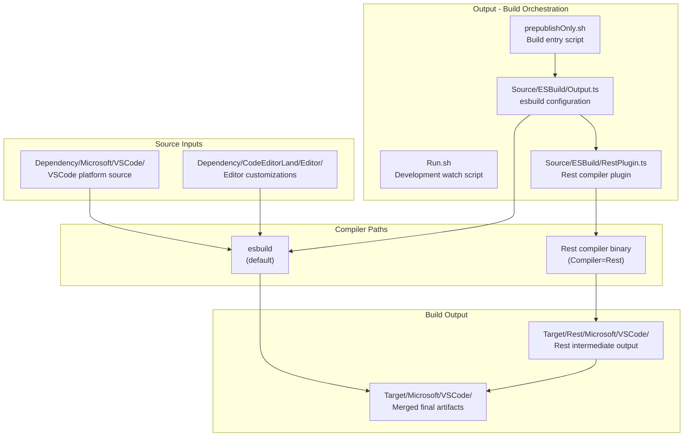
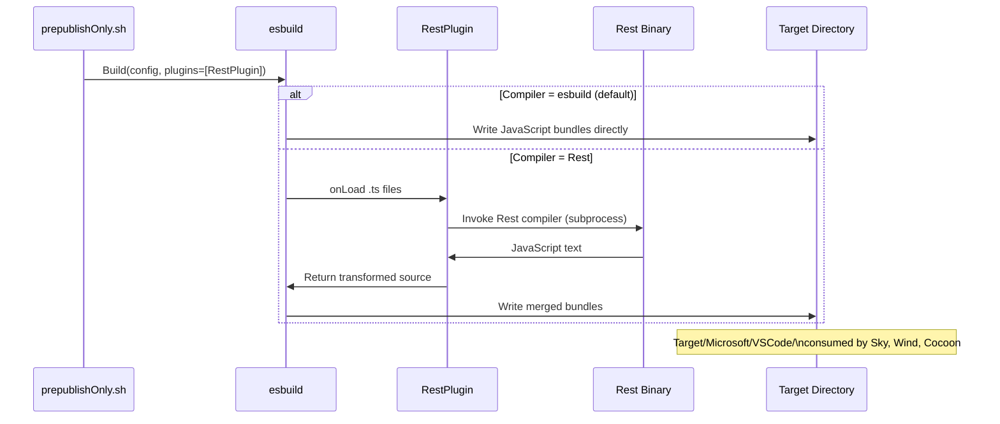

# Output - Deep Dive

This document provides the technical foundation for the Output build artifact
management package within the Land ecosystem. **Output** orchestrates
compilation of VSCode's TypeScript source and CodeEditorLand editor code into
JavaScript bundles consumed by Sky, Wind, and Cocoon.

---

## Architecture

Output is a JavaScript/TypeScript build package that wraps esbuild. It supports
two compiler modes - the default esbuild pipeline and an optional Rest
(OXC-based) pipeline - selectable at build time through environment variables.

---

## Key Modules

| Path                                             | Description                                                                  |
| :----------------------------------------------- | :--------------------------------------------------------------------------- |
| `Source/prepublishOnly.sh`                       | Main build script; sets environment and invokes esbuild configuration        |
| `Source/Run.sh`                                  | Development watch script for incremental builds                              |
| `Source/ESBuild/Output.ts`                       | esbuild programmatic configuration: format, platform, target, plugin wiring  |
| `Source/ESBuild/RestPlugin.ts`                   | esbuild plugin that intercepts TypeScript files and delegates to Rest binary |
| `Source/ESBuild/Microsoft/`                      | esbuild entry point configurations for VSCode platform bundles               |
| `Source/ESBuild/CodeEditorLand/`                 | esbuild entry point configurations for editor customization bundles          |
| `Source/ESBuild/Exclude/`                        | Module exclusion rules for platform-incompatible VSCode code paths           |
| `Configuration/ESBuild/Microsoft/VSCode.js`      | esbuild config for the Microsoft/VSCode dependency                           |
| `Configuration/ESBuild/CodeEditorLand/Editor.js` | esbuild config for the CodeEditorLand/Editor dependency                      |
| `Target/Microsoft/VSCode/`                       | Final merged JavaScript artifacts consumed at runtime                        |

---

## Data Flow

**Artifact merge sequence (Rest mode):**

1. Rest compiles TypeScript source into `Target/Rest/Microsoft/VSCode/`.
2. esbuild reads Rest output through `RestPlugin` interception.
3. esbuild applies bundling, tree-shaking, and merging.
4. Final artifacts land in `Target/Microsoft/VSCode/`.

---

## Integration Points

| Connecting Element | Direction | Mechanism                            | Description                                                                   |
| :----------------- | :-------- | :----------------------------------- | :---------------------------------------------------------------------------- |
| **Rest**           | Consumer  | Process invocation                   | `RestPlugin.ts` spawns the Rest binary as a child process per TypeScript file |
| **Sky**            | Provider  | `@codeeditorland/output` npm package | Sky imports VSCode core UI components from the Output package artifacts       |
| **Wind**           | Provider  | `@codeeditorland/output` npm package | Wind imports VSCode workbench service implementations from Output artifacts   |
| **Cocoon**         | Provider  | File path reference                  | Cocoon loads JavaScript modules from `Target/Microsoft/VSCode/` at startup    |

---

## Configuration

| Variable           | Default            | Description                                                 |
| :----------------- | :----------------- | :---------------------------------------------------------- |
| `Compiler`         | `esbuild`          | Set to `Rest` to enable OXC-based TypeScript compilation    |
| `REST_BINARY_PATH` | auto-detect        | Override path to the Rest compiler binary                   |
| `REST_OPTIONS`     | empty              | Additional flags passed to the Rest compiler                |
| `REST_VERBOSE`     | `false`            | Enable verbose Rest compiler logging for troubleshooting    |
| `Dependency`       | `Microsoft/VSCode` | Source dependency directory to process                      |
| `NODE_ENV`         | `production`       | Controls source map generation (`development` enables maps) |

The `Compiler=Rest` path produces identical JavaScript semantics to the esbuild
path while running 2-3x faster on TypeScript-heavy codebases, at the cost of
relying on the Rest binary being available in the build environment.
