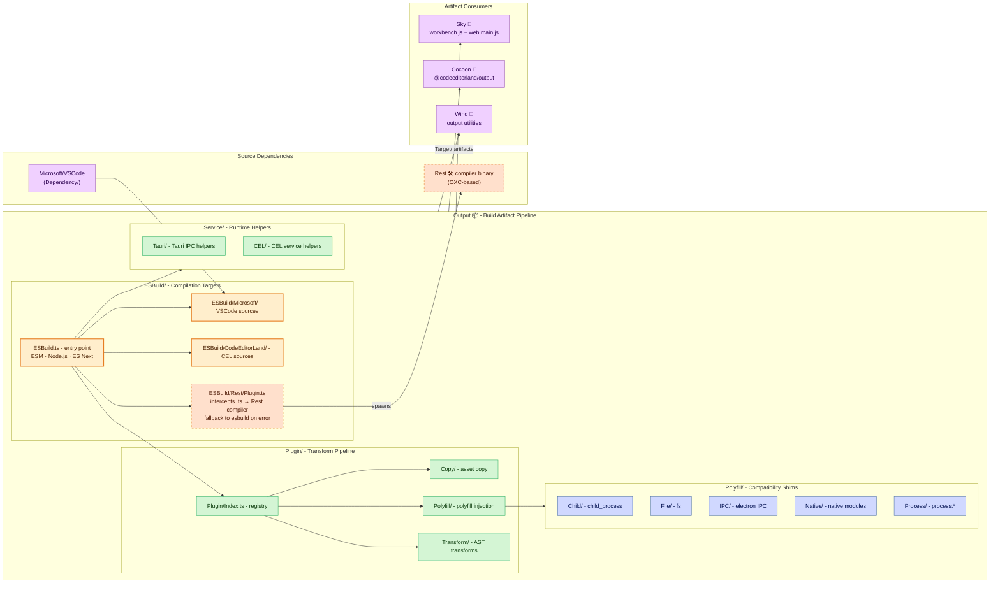

# **Output**&#x2001;📦

<table>
	<tr>
		<td>
			<a href="https://GitHub.Com/CodeEditorLand/Output" target="_blank">
				<picture>
					<source media="(prefers-color-scheme: dark)" srcset="https://img.shields.io/github/last-commit/CodeEditorLand/Output?label=Last-commit&color=black&labelColor=black&logoColor=white&logoWidth=0" />
					<source media="(prefers-color-scheme: light)" srcset="https://img.shields.io/github/last-commit/CodeEditorLand/Output?label=Last-commit&color=white&labelColor=white&logoColor=black&logoWidth=0" />
					
				</picture>
			</a>
			<br />
			<a href="https://GitHub.Com/CodeEditorLand/Output" target="_blank">
				<picture>
					<source media="(prefers-color-scheme: dark)" srcset="https://img.shields.io/github/issues/CodeEditorLand/Output?label=Issues&color=black&labelColor=black&logoColor=white&logoWidth=0" />
					<source media="(prefers-color-scheme: light)" srcset="https://img.shields.io/github/issues/CodeEditorLand/Output?label=Issues&color=white&labelColor=white&logoColor=black&logoWidth=0" />
					
				</picture>
			</a>
		</td>
		<td>
			<a href="https://github.com/CodeEditorLand/Output" target="_blank">
				<picture>
					<source media="(prefers-color-scheme: dark)" srcset="https://img.shields.io/github/stars/CodeEditorLand/Output?style=flat&label=Star&logo=github&color=black&labelColor=black&logoColor=white&logoWidth=0" />
					<source media="(prefers-color-scheme: light)" srcset="https://img.shields.io/github/stars/CodeEditorLand/Output?style=flat&label=Star&logo=github&color=white&labelColor=white&logoColor=black&logoWidth=0" />
					
				</picture>
			</a>
			<br />
			<a href="https://GitHub.Com/CodeEditorLand/Output" target="_blank">
				<picture>
					<source media="(prefers-color-scheme: dark)" srcset="https://img.shields.io/github/downloads/CodeEditorLand/Output?label=Downloads&color=black&labelColor=black&logoColor=white&logoWidth=0" />
					<source media="(prefers-color-scheme: light)" srcset="https://img.shields.io/github/downloads/CodeEditorLand/Output?label=Downloads&color=white&labelColor=white&logoColor=black&logoWidth=0" />
					
				</picture>
			</a>
		</td>
	</tr>
</table>

The Build Output & Artifact Management for Land&#x2001;🏞️

> **Build processes that produce different artifacts depending on the machine,
> CI environment, or implicit tool versions make debugging production issues
> impossible. Output ensures the same commit produces the same output every
> time — deterministic, reproducible, and verifiable.**

_"Compile once, ship anywhere. The build is part of the source, not the
environment."_

[](https://github.com/CodeEditorLand/Output/blob/Current/LICENSE)
[](https://www.npmjs.com/package/@codeeditorland/output)
[](https://esbuild.github.io/)
[](https://oxc.rs/)

**[Output NPM Package](https://www.npmjs.com/package/@codeeditorland/output)**&#x2001;📦

---

## Overview

**Output** is the build system and artifact management package for the **Land**
Code Editor. It handles the compilation, processing, and distribution of source
code from various dependencies including VSCode, CodeEditorLand Editor, and the
Rest compiler pipeline. Output orchestrates multi-compiler builds supporting
both `esbuild` and Rest (`OXC`-based) compilation pipelines with seamless
integration.

Build processes that produce different artifacts depending on the machine, CI
environment, or implicit tool versions make debugging production issues
impossible — Output ensures the same commit produces the same output every time
through deterministic build configurations and artifact verification.

**Output is engineered to:**

1. **Orchestrate Multi-Compiler Builds** — Support both `esbuild` and Rest
   (`OXC`-based) compilation pipelines with seamless integration.
2. **Manage Build Artifacts** — Organize and deliver optimized `JavaScript`
   artifacts for consumption by Sky, Wind, and Cocoon.
3. **Provide Hybrid Workflows** — Enable incremental migration from `esbuild`
   to Rest through conditional compilation and plugin-based architecture.
4. **Ensure Build Reproducibility** — Maintain consistent output through
   deterministic build configurations and artifact verification.

---

## Key Features&#x2001;📦

**Dual-Compiler Pipeline** — Supports both `esbuild` and Rest (`OXC`-based)
compilation. The `Compiler` environment variable selects the active compiler,
and the RestPlugin intercepts `.ts` files for `OXC` processing with automatic
fallback to `esbuild` on errors.

**Plugin Architecture** — A composable plugin system (`Source/Plugin/`)
supporting asset copy, polyfill injection, and AST transforms. Plugins register
through `Plugin/Index.ts` and compose into the build pipeline via
`Apply/Pipeline.ts`.

**Compatibility Polyfills** — Comprehensive polyfill layer
(`Source/Polyfill/`) for `Node.js` APIs including `child_process`, `fs`, `IPC`,
native modules, and `process.*`. Enables VS Code platform code to run outside
its native `Electron` environment.

**Asset Management** — Asset copy and style processing through
`Source/Asset/Style/`, with transform plugins for CSS imports, icon stylesheet
URLs, and webview blob URL rewriting.

**Service Layer** — Runtime service helpers for Tauri (`IPC` helpers) and
CodeEditorLand (shared process, search, updates, telemetry, extension gallery)
providing platform-specific backend integration.

**Hybrid TypeScript Workflow** — Support for incremental migration from
`esbuild` to Rest through conditional compilation. Source maps are generated in
development mode (`NODE_ENV=development`) for both compilers.

---

## Core Architecture Principles&#x2001;🏗️

| Principle | Description | Key Components |
|-----------|-------------|----------------|
| **Compiler Agnosticism** | Multiple compiler backends behind a unified plugin interface so compiler choice is a config flag, not a code change. | `ESBuild/Output`, `ESBuild/Rest/Plugin`, `Plugin/Index` |
| **Deterministic Builds** | Same commit produces same output every time through locked configurations and reproducible build pipelines. | `Configuration/ESBuild/`, `ESBuild/Exclude/` |
| **Plugin Composability** | Modular plugin system where transforms, polyfills, and copies compose into a single pipeline. | `Plugin/Index`, `Plugin/Type`, `Apply/Pipeline` |
| **Polyfill Completeness** | Ensure platform code runs outside `Electron` by providing compatible shims for all `Node.js` APIs. | `Polyfill/Child/`, `Polyfill/File/`, `Polyfill/IPC/`, `Polyfill/Native/`, `Polyfill/Process/` |

---

## System Architecture&#x2001;



**Connection paths:**

| Path | Protocol | Use Case |
|------|----------|----------|
| Source → `ESBuild/Microsoft/` | Direct file read | VSCode platform code compilation |
| Source → `ESBuild/CodeEditorLand/` | Direct file read | CEL platform code compilation |
| `.ts` → RestPlugin → Rest binary | `Compiler=Rest` env flag | `OXC`-based TypeScript compilation |
| `Plugin/Index` → `Copy/`, `Polyfill/`, `Transform/` | Plugin registry | Composable transform pipeline |
| `Output/` → Sky | `Target/` artifacts (`workbench.js`, `web.main.js`) | Workbench delivery |
| `Output/` → Cocoon | `@codeeditorland/output` npm package | Extension host consumption |
| `Output/` → Wind | `Target/` utilities | Build tooling integration |

---

## Key Components

| Component | Path | Description |
|-----------|------|-------------|
| ESBuild Entry | `Source/ESBuild.ts` | ESBuild entry point and configuration |
| ESBuild Output | `Source/ESBuild/Output.ts` | ESBuild configuration with ESM format, Node.js platform, ES Next target, and conditional Rest plugin integration |
| Rest Plugin | `Source/ESBuild/Rest/Plugin.ts` | TypeScript file interception, Rest compiler invocation, source map generation, and fallback to esbuild on errors |
| Microsoft Targets | `Source/ESBuild/Microsoft/` | VSCode build targets |
| CodeEditorLand Targets | `Source/ESBuild/CodeEditorLand/` | CEL build targets |
| Exclude Patterns | `Source/ESBuild/Exclude/` | Module exclusion patterns for build filtering |
| Plugin Index | `Source/Plugin/Index.ts` | Plugin registration and composition |
| Plugin Types | `Source/Plugin/Type.ts` | Plugin type definitions |
| Plugin Apply | `Source/Plugin/Apply.ts` | Plugin application logic |
| Apply Pipeline | `Source/Apply/Pipeline.ts` | Transform pipeline orchestration |
| Copy Plugin | `Source/Plugin/Copy/` | Asset copy plugin |
| Polyfill Plugin | `Source/Plugin/Polyfill/` | Polyfill injection plugin |
| Transform Plugin | `Source/Plugin/Transform/` | AST transform plugin (20+ transform sub-modules) |
| Child Process Polyfill | `Source/Polyfill/Child/` | `child_process` polyfills |
| File System Polyfill | `Source/Polyfill/File/` | `fs` polyfills |
| IPC Polyfill | `Source/Polyfill/IPC/` | `Electron` IPC polyfills |
| Native Module Polyfill | `Source/Polyfill/Native/` | Native module polyfills |
| Process Polyfill | `Source/Polyfill/Process/` | `process.*` polyfills |
| Telemetry Polyfill | `Source/Polyfill/Telemetry.ts` | Telemetry polyfill |
| Asset Style | `Source/Asset/Style/` | Asset style processing |
| Tauri Service | `Source/Service/Tauri/` | Tauri IPC service helpers |
| CEL Service | `Source/Service/CEL/` | CodeEditorLand service helpers |
| Dev Service | `Source/Service/Dev/` | Development service helpers |
| Trace Service | `Source/Service/Trace.ts` | Build tracing utilities |
| Build Script | `Source/prepublishOnly.sh` | Build orchestration script |
| Dev Script | `Source/Run.sh` | Development watch mode |

---

## Project Structure&#x2001;🗺️

```
Output/
├── Source/
│   ├── ESBuild.ts              # ESBuild entry point and configuration.
│   ├── ESBuild/
│   │   ├── Output.ts           # ESBuild output compilation settings.
│   │   ├── CodeEditorLand/     # CodeEditorLand-specific build targets.
│   │   ├── Microsoft/          # Microsoft/VSCode build targets.
│   │   ├── Rest/               # Rest (OXC) compiler integration.
│   │   └── Exclude/            # Module exclusion patterns.
│   ├── Apply/
│   │   └── Pipeline.ts         # Transform pipeline orchestration.
│   ├── Plugin/
│   │   ├── Index.ts            # Plugin registration and composition.
│   │   ├── Type.ts             # Plugin type definitions.
│   │   ├── Apply.ts            # Plugin application logic.
│   │   ├── Copy/               # Asset copy plugin.
│   │   ├── Polyfill/           # Polyfill injection plugin.
│   │   └── Transform/          # AST transform plugin (20+ modules).
│   ├── Polyfill/
│   │   ├── Telemetry.ts        # Telemetry polyfill.
│   │   ├── Child/              # Child process polyfills.
│   │   ├── File/               # File system polyfills.
│   │   ├── IPC/                # IPC polyfills.
│   │   ├── Native/             # Native module polyfills.
│   │   ├── Process/            # Process polyfills.
│   │   └── Shared/             # Shared polyfill utilities.
│   ├── Asset/
│   │   └── Style/              # Asset style processing.
│   ├── Service/
│   │   ├── Trace.ts            # Build tracing utilities.
│   │   ├── CEL/                # CodeEditorLand service helpers.
│   │   ├── Dev/                # Development service helpers.
│   │   └── Tauri/              # Tauri service helpers.
│   ├── tsconfig/               # TypeScript configuration profiles.
│   ├── prepublishOnly.sh       # Build orchestration script.
│   └── Run.sh                  # Development watch mode.
├── Configuration/
│   └── ESBuild/                # ESBuild build profiles.
├── Target/                     # Build output destination.
└── package.json
```

---

## In the Land Project

Output provides the compilation and artifact pipeline consumed by Sky
(`workbench.js` + `web.main.js`), Cocoon (`@codeeditorland/output`), and Wind
(output utilities). It pulls source from VSCode (`Dependency/`) and optionally
the Rest compiler binary. Output supports dual-compiler operation via the
`Compiler` environment variable. When `Compiler=Rest` is set, the RestPlugin
intercepts `.ts` files and spawns the Rest binary for `OXC`-based compilation,
merging results into the `esbuild` output stream.

The plugin system (`Plugin/Index.ts`) composes transforms, polyfills, and
copies into a single build pipeline orchestrated by `Apply/Pipeline.ts`.

| Consumer | Artifact | Format |
|----------|----------|--------|
| **Sky** | `workbench.js` + `web.main.js` | ESM bundles from `Target/` |
| **Cocoon** | `@codeeditorland/output` npm package | Node.js ESM |
| **Wind** | Output utilities | Build tooling modules |

### Compiler Backends

Output supports two compilation backends:

| Backend | Runtime | Strength |
|---------|---------|----------|
| **esbuild** | Go-based | Rich plugin ecosystem, general bundling |
| **Rest (OXC)** | Rust-based (`OXC`) | Ultra-fast TypeScript compilation, parallel processing |

Rest leverages the **OXC (Oxidation Compiler)** ecosystem:

- `oxc_parser` — Ultra-fast `JavaScript`/`TypeScript` parser with ESTree
  compatibility
- `oxc_transformer` — AST transformation engine supporting `TypeScript`, `JSX`,
  and modern `ECMAScript` features
- `oxc_codegen` — Efficient code generation from AST
- `oxc_semantic` — Semantic analysis and symbol table construction

### Configuration Options

| Variable | Default | Description |
| :--- | :--- | :--- |
| `Compiler` | `esbuild` | Compiler to use (`esbuild` or `Rest`) |
| `REST_BINARY_PATH` | auto-detect | Override Rest binary location |
| `REST_OPTIONS` | empty | Additional Rest compiler flags |
| `REST_VERBOSE` | `false` | Enable verbose Rest logging |
| `Dependency` | `Microsoft/VSCode` | Source dependency to process |
| `NODE_ENV` | `production` | Build environment (`development` or `production`) |

---

## Getting Started&#x2001;🚀

### Prerequisites

- **Node.js** 20 or later
- **pnpm** package manager
- Rest compiler binary (optional, for `OXC`-based builds)

### Installation

```sh
pnpm add @codeeditorland/output
```

### Build

```bash
# Default esbuild build
npm run prepublishOnly

# Rest compiler build
export Compiler=Rest
npm run prepublishOnly

# Development mode with Rest
export NODE_ENV=development
export Compiler=Rest
npm run Run
```

### Troubleshooting

**Rest Binary Not Found:**

```bash
export REST_BINARY_PATH=/usr/local/bin/rest
```

**Compilation Errors — enable verbose logging:**

```bash
export REST_VERBOSE=true
```

**Source Maps Not Generated:**

```bash
export NODE_ENV=development
```

---

## Compatibility

Output is designed to be compatible with:

| Target | Integration |
|--------|-------------|
| **Sky** | Produces `workbench.js` and `web.main.js` ESM bundles |
| **Cocoon** | Published as `@codeeditorland/output` npm package |
| **Wind** | Build tooling integration via `Target/` artifacts |
| **esbuild** | Full plugin ecosystem support via `ESBuild/` configuration |
| **Rest (OXC)** | `OXC`-based TypeScript compilation via `ESBuild/Rest/Plugin.ts` |

---

## API Reference

- [Output NPM Package](https://www.npmjs.com/package/@codeeditorland/output)

---

## Related Documentation

- [Architecture Overview](https://Editor.Land/Doc/architecture) — Land system
  architecture
- [Rest](https://github.com/CodeEditorLand/Rest) — `Rust`/`OXC` TypeScript
  compiler
- [Cocoon](https://github.com/CodeEditorLand/Cocoon) — `Node.js` extension host
- [Sky](https://github.com/CodeEditorLand/Sky) — Workbench shell
- [Wind](https://github.com/CodeEditorLand/Wind) — Build tooling and utilities

---

## Funding & Acknowledgements&#x2001;🙏🏻

This project is funded through
[NGI0 Commons Fund](https://NLnet.NL/commonsfund), a fund established by
[NLnet](https://NLnet.NL) with financial support from the European Commission's
Next Generation Internet program, under grant agreement No 101135429.

The project is operated by PlayForm, based in Sofia, Bulgaria. PlayForm acts as
the open-source steward for Code Editor Land under the NGI0 Commons Fund grant.

<table>
	<tbody>
		<tr>
			<td align="left" valign="middle">
				<a href="https://Editor.Land">
					
				</a>
			</td>
			<td align="left" valign="middle">
				<a href="https://PlayForm.Cloud">
					
				</a>
			</td>
			<td align="left" valign="middle">
				<a href="https://NLnet.NL">
					
				</a>
			</td>
			<td align="left" valign="middle">
				<a href="https://NLnet.NL/commonsfund">
					
				</a>
			</td>
		</tr>
	</tbody>
</table>
