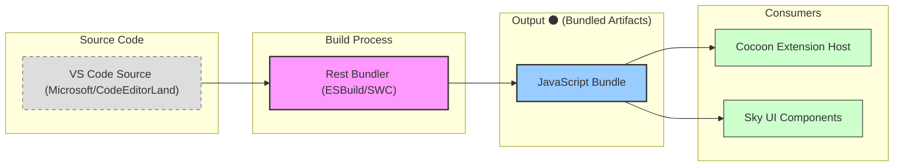

<table>
<tr>
<td align="left" valign="middle">
<h3 align="left">Output</h3>
</td>
<td align="left" valign="middle">
<h3 align="left">⚫</h3>
</td>
<td align="left" valign="middle">
<h3 align="left">+</h3>
</td>
<td align="left" valign="middle">
<h3 align="left">
<a href="https://Editor.Land" target="_blank">
<picture>
<source media="(prefers-color-scheme: dark)" srcset="https://PlayForm.Cloud/Dark/Image/GitHub/Land.svg">
<source media="(prefers-color-scheme: light)" srcset="https://PlayForm.Cloud/Image/GitHub/Land.svg">

</picture>
</a>
</h3>
</td>
<td align="left" valign="middle">
<h3 align="left">
<a href="https://Editor.Land" target="_blank">
Land
</a>
</h3>
</td>
<td align="left" valign="middle">
<h3 align="left">🏞️</h3>
</td>
</tr>
</table>

---

# **Output** ⚫ The Bundled JavaScript Artifacts for Land 🏞️

[](https://github.com/CodeEditorLand/Output/tree/Current/LICENSE)
[](https://www.npmjs.com/package/@codeeditorland/output)

Welcome to **Output**, the bundled JavaScript artifacts for the **Land Code
Editor**. Output contains the ESM builds of VS Code source from both the
Microsoft repository and the CodeEditorLand fork, serving as the runtime
foundation for `Cocoon` (extension host) and `Sky` (UI components).

**Output** is engineered to:

1. **Provide Bundled Artifacts:** Deliver pre-built JavaScript bundles from VS
   Code source for immediate consumption.
2. **Support Dual Sources:** Include builds from both Microsoft/VSCode and
   CodeEditorLand/Editor repositories.
3. **Enable Extension Compatibility:** Supply the platform code necessary for
   `Cocoon` to run VS Code extensions.
4. **Power UI Components:** Provide the core UI code used by `Sky` for rendering
   the editor interface.

Output is the `ESM` build of all of `VSCode`. It includes two builds:

🎁 [`VSCode (CodeEditorLand/Editor)`][CodeEditorLand]

🎁 [`VSCode (Microsoft/VSCode)`][Microsoft]

[Output]: https://NPMJS.Org/@codeeditorland/output
[CodeEditorLand]: https://GitHub.Com/CodeEditorLand/Editor.git
[Microsoft]: https://GitHub.Com/Microsoft/VSCode.git

---

## Deep Dive & Component Breakdown 🔬

**Output** contains the bundled JavaScript artifacts from the VS Code source.
For details on the build process that generates these artifacts, refer to the
[`Rest`](https://github.com/CodeEditorLand/Rest) element which contains the
bundling configuration. The Output directory serves as the destination for:

- **VSCode Core UI Components** - Used by `Sky` for rendering the editor
  interface
- **VSCode Platform Code** - Used by `Cocoon` for extension host compatibility

The build process is triggered with the `Bundle=true` environment variable
during the Land build process.

---

## Key Features 🔐

- **Dual Source Builds:** Includes bundled artifacts from both Microsoft/VSCode
  and CodeEditorLand/Editor repositories for maximum compatibility.
- **ESM Format:** All bundles are built as ES Modules for modern JavaScript
  runtime compatibility.
- **Cocoon Runtime Support:** Provides the complete VS Code platform code
  necessary for the Node.js extension host.
- **Sky UI Components:** Supplies the core UI code used by the Astro-based
  frontend for rendering the editor interface.

---

## Core Architecture Principles 🏗️

| Principle                 | Description                                                                           | Key Components Involved                   |
| :------------------------ | :------------------------------------------------------------------------------------ | :---------------------------------------- |
| **Build Reproducibility** | Ensure consistent, deterministic builds from VS Code source for reliable deployments. | `Rest` bundler, ESBuild/SWC configuration |
| **Source Fidelity**       | Maintain high compatibility with upstream VS Code source for extension support.       | Microsoft/VSCode, CodeEditorLand/Editor   |
| **Modular Output**        | Organize bundled artifacts for consumption by multiple consumers (`Cocoon`, `Sky`).   | Bundle structure, ESM exports             |

---

## `Output` in the Land Ecosystem ⚫ + 🏞️

| Component                  | Role & Key Responsibilities                                                       |
| :------------------------- | :-------------------------------------------------------------------------------- |
| **VSCode Platform Bundle** | Core platform code from VSCode used by `Cocoon` for extension API implementation. |
| **UI Component Bundle**    | Editor UI components consumed by `Sky` for rendering the workbench.               |
| **Rest Build Output**      | The destination for all bundled JavaScript artifacts from the `Rest` bundler.     |

---

## Getting Started 🚀

### Installation

To use `Output` in your project:

```sh
pnpm add @codeeditorland/output
```

**Key Dependencies:**

- `@codeeditorland/rest`: The bundler that generates the output artifacts
- VS Code source from `Microsoft/VSCode` or `CodeEditorLand/Editor`

### Usage Pattern

`Output` is primarily used as a build artifact rather than a direct dependency:

1. **Build with Rest:** Run the `Rest` bundler with `Bundle=true` to generate
   artifacts
2. **Consume in Cocoon:** Load the bundled platform code in the extension host
3. **Consume in Sky:** Import UI components for the frontend

---

## System Architecture Diagram 🏗️

This diagram illustrates how `Output` fits into the Land build and runtime
process.



---

## Changelog 📜

See [`CHANGELOG.md`](https://github.com/CodeEditorLand/Output/tree/Current/) for
a history of changes to this component.

---

## Funding & Acknowledgements 🙏🏻

**Output** is a core element of the **Land** ecosystem. This project is funded
through [NGI0 Commons Fund](https://NLnet.NL/commonsfund), a fund established by
[NLnet](https://NLnet.NL) with financial support from the European Commission's
[Next Generation Internet](https://ngi.eu) program. Learn more at the
[NLnet project page](https://NLnet.NL/project/Land).

<table>
	<thead>
		<tr>
			<th align="left"><strong>Land</strong></th>
			<th align="left"><strong>PlayForm</strong></th>
			<th align="left"><strong>NLnet</strong></th>
			<th align="left"><strong>NGI0 Commons Fund</strong></th>
		</tr>
	</thead>
	<tbody>
		<tr>
			<td align="left" valign="middle">
				<a href="https://Editor.Land">
					
				</a>
			</td>
			<td align="left" valign="middle">
				<a href="https://PlayForm.Cloud">
					
				</a>
			</td>
			<td align="left" valign="middle">
				<a href="https://NLnet.NL">
					
				</a>
			</td>
			<td align="left" valign="middle">
				<a href="https://NLnet.NL/commonsfund">
					
				</a>
			</td>
		</tr>
	</tbody>
</table>

---

**Project Maintainers**: Source Open
([Source/Open@Editor.Land](mailto:Source/Open@Editor.Land)) |
[GitHub Repository](https://github.com/CodeEditorLand/Output) |
[Report an Issue](https://github.com/CodeEditorLand/Output/issues) |
[Security Policy](https://github.com/CodeEditorLand/Output/security/policy)
