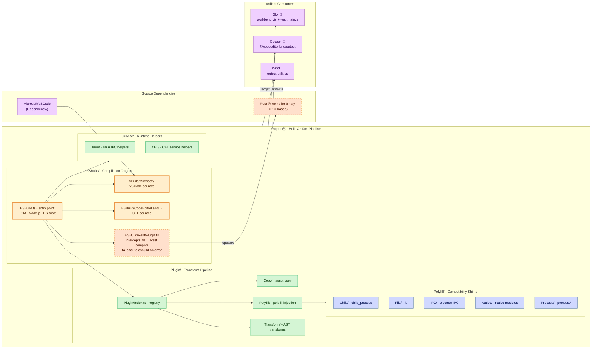

# **Output**&#x2001;📦

<table>
	<tr>
		<td>
			<a href="https://GitHub.Com/CodeEditorLand/Output" target="_blank">
				<picture>
					<source media="(prefers-color-scheme: dark)" srcset="https://img.shields.io/github/last-commit/CodeEditorLand/Output?label=Last-commit&color=black&labelColor=black&logoColor=white&logoWidth=0" />
					<source media="(prefers-color-scheme: light)" srcset="https://img.shields.io/github/last-commit/CodeEditorLand/Output?label=Last-commit&color=white&labelColor=white&logoColor=black&logoWidth=0" />
					
				</picture>
			</a>
			<br />
			<a href="https://GitHub.Com/CodeEditorLand/Output" target="_blank">
				<picture>
					<source media="(prefers-color-scheme: dark)" srcset="https://img.shields.io/github/issues/CodeEditorLand/Output?label=Issues&color=black&labelColor=black&logoColor=white&logoWidth=0" />
					<source media="(prefers-color-scheme: light)" srcset="https://img.shields.io/github/issues/CodeEditorLand/Output?label=Issues&color=white&labelColor=white&logoColor=black&logoWidth=0" />
					
				</picture>
			</a>
		</td>
		<td>
			<a href="https://github.com/CodeEditorLand/Output" target="_blank">
				<picture>
					<source media="(prefers-color-scheme: dark)" srcset="https://img.shields.io/github/stars/CodeEditorLand/Output?style=flat&label=Star&logo=github&color=black&labelColor=black&logoColor=white&logoWidth=0" />
					<source media="(prefers-color-scheme: light)" srcset="https://img.shields.io/github/stars/CodeEditorLand/Output?style=flat&label=Star&logo=github&color=white&labelColor=white&logoColor=black&logoWidth=0" />
					
				</picture>
			</a>
			<br />
			<a href="https://GitHub.Com/CodeEditorLand/Output" target="_blank">
				<picture>
					<source media="(prefers-color-scheme: dark)" srcset="https://img.shields.io/github/downloads/CodeEditorLand/Output?label=Downloads&color=black&labelColor=black&logoColor=white&logoWidth=0" />
					<source media="(prefers-color-scheme: light)" srcset="https://img.shields.io/github/downloads/CodeEditorLand/Output?label=Downloads&color=white&labelColor=white&logoColor=black&logoWidth=0" />
					
				</picture>
			</a>
		</td>
	</tr>
</table>

The Build Output & Artifact Management for Land 🏞️

[](https://github.com/CodeEditorLand/Output/blob/Current/LICENSE)
[](https://www.npmjs.com/package/@codeeditorland/output)
[](https://esbuild.github.io/)
[](https://oxc.rs/)

---

## Overview

Output is the build output and artifact management package for the Land Code
Editor. It handles the compilation, processing, and distribution of source code
from various dependencies including VSCode, CodeEditorLand Editor, and the Rest
compiler pipeline. Build processes that produce different artifacts depending on
the machine, CI environment, or implicit tool versions make debugging production
issues impossible - Output ensures the same commit produces the same output
every time.

**Output is engineered to:**

1. **Orchestrate Multi-Compiler Builds:** Support both esbuild and Rest
   (OXC-based) compilation pipelines with seamless integration.
2. **Manage Build Artifacts:** Organize and deliver optimized JavaScript
   artifacts for consumption by Sky, Wind, and Cocoon.
3. **Provide Hybrid Workflows:** Enable incremental migration from esbuild to
   Rest through conditional compilation and plugin-based architecture.
4. **Ensure Build Reproducibility:** Maintain consistent output through
   deterministic build configurations and artifact verification.

## Architecture



## Key Components

| Component              | Path                             | Description                                                                                                      |
| ---------------------- | -------------------------------- | ---------------------------------------------------------------------------------------------------------------- |
| ESBuild Entry          | `Source/ESBuild.ts`              | ESBuild entry point and configuration                                                                            |
| ESBuild Output         | `Source/ESBuild/Output.ts`       | ESBuild configuration with ESM format, Node.js platform, ES Next target, and conditional Rest plugin integration |
| Rest Plugin            | `Source/ESBuild/Rest/Plugin.ts`  | TypeScript file interception, Rest compiler invocation, source map generation, and fallback to esbuild on errors |
| Microsoft Targets      | `Source/ESBuild/Microsoft/`      | VSCode build targets                                                                                             |
| CodeEditorLand Targets | `Source/ESBuild/CodeEditorLand/` | CEL build targets                                                                                                |
| Plugin Index           | `Source/Plugin/Index.ts`         | Plugin registration and composition                                                                              |
| Apply Pipeline         | `Source/Apply/Pipeline.ts`       | Transform pipeline orchestration                                                                                 |
| Build Script           | `Source/prepublishOnly.sh`       | Build orchestration script                                                                                       |

## In the Land Project

Output provides the compilation and artifact pipeline consumed by Sky
(workbench.js + web.main.js), Cocoon (`@codeeditorland/output`), and Wind
(output utilities). It pulls source from VSCode (Dependency/) and optionally the
Rest compiler binary. Output supports dual-compiler operation via the `Compiler`
environment variable. When `Compiler=Rest` is set, the RestPlugin intercepts
`.ts` files and spawns the Rest binary for OXC-based compilation, merging
results into the esbuild output stream.

### Rest Compiler Integration

Rest leverages the **OXC (Oxidation Compiler)** ecosystem:

- `oxc_parser`: Ultra-fast JavaScript/TypeScript parser with ESTree
  compatibility
- `oxc_transformer`: AST transformation engine supporting TypeScript, JSX, and
  modern ECMAScript features
- `oxc_codegen`: Efficient code generation from AST
- `oxc_semantic`: Semantic analysis and symbol table construction

### Configuration Options

| Variable           | Default            | Description                                       |
| :----------------- | :----------------- | :------------------------------------------------ |
| `Compiler`         | `esbuild`          | Compiler to use (`esbuild` or `Rest`)             |
| `REST_BINARY_PATH` | auto-detect        | Override Rest binary location                     |
| `REST_OPTIONS`     | empty              | Additional Rest compiler flags                    |
| `REST_VERBOSE`     | `false`            | Enable verbose Rest logging                       |
| `Dependency`       | `Microsoft/VSCode` | Source dependency to process                      |
| `NODE_ENV`         | `production`       | Build environment (`development` or `production`) |

### esbuild vs Rest Comparison

| Feature            | esbuild                 | Rest (OXC)                 |
| :----------------- | :---------------------- | :------------------------- |
| Implementation     | Go-based                | Rust-based (OXC)           |
| TypeScript Support | Full                    | Full                       |
| Speed              | Very Fast (10-100x tsc) | Ultra-Fast (parallel, OXC) |
| Source Maps        | Yes                     | Yes                        |
| Tree Shaking       | Yes                     | Yes                        |
| Plugin System      | Rich ecosystem          | Emerging                   |
| Best For           | General bundling        | TypeScript-heavy projects  |
| Watch Mode         | Yes                     | Yes (via notify)           |
| Minification       | Yes                     | Yes (oxc_minifier)         |

### Directory Structure

```
Output/
├── Source/
│   ├── ESBuild.ts              # ESBuild entry point and configuration.
│   ├── ESBuild/
│   │   ├── Output.ts           # ESBuild output compilation settings.
│   │   ├── CodeEditorLand/     # CodeEditorLand-specific build targets.
│   │   ├── Microsoft/          # Microsoft/VSCode build targets.
│   │   ├── Rest/               # Rest (OXC) compiler integration.
│   │   └── Exclude/            # Module exclusion patterns.
│   ├── Apply/
│   │   └── Pipeline.ts         # Transform pipeline orchestration.
│   ├── Plugin/
│   │   ├── Index.ts            # Plugin registration and composition.
│   │   ├── Type.ts             # Plugin type definitions.
│   │   ├── Apply.ts            # Plugin application logic.
│   │   ├── Copy/               # Asset copy plugin.
│   │   ├── Polyfill/           # Polyfill injection plugin.
│   │   └── Transform/          # AST transform plugin.
│   ├── Polyfill/
│   │   ├── Telemetry.ts        # Telemetry polyfill.
│   │   ├── Child/              # Child process polyfills.
│   │   ├── File/               # File system polyfills.
│   │   ├── IPC/                # IPC polyfills.
│   │   ├── Native/             # Native module polyfills.
│   │   ├── Process/            # Process polyfills.
│   │   └── Shared/             # Shared polyfill utilities.
│   ├── Asset/
│   │   └── Style/              # Asset style processing.
│   ├── Service/
│   │   ├── Trace.ts            # Build tracing utilities.
│   │   ├── CEL/                # CodeEditorLand service helpers.
│   │   ├── Dev/                # Development service helpers.
│   │   └── Tauri/              # Tauri service helpers.
│   ├── tsconfig/               # TypeScript configuration profiles.
│   ├── prepublishOnly.sh       # Build orchestration script.
│   └── Run.sh                  # Development watch mode.
├── Configuration/
│   └── ESBuild/               # ESBuild build profiles.
├── Target/                    # Build output destination.
└── package.json
```

## Getting Started

### Installation

```sh
pnpm add @codeeditorland/output
```

### Usage

```bash
# Default esbuild build
npm run prepublishOnly

# Rest compiler build
export Compiler=Rest
npm run prepublishOnly

# Development mode with Rest
export NODE_ENV=development
export Compiler=Rest
npm run Run
```

### Troubleshooting

**Rest Binary Not Found:**

```bash
export REST_BINARY_PATH=/usr/local/bin/rest
```

**Compilation Errors - enable verbose logging:**

```bash
export REST_VERBOSE=true
```

**Source Maps Not Generated:**

```bash
export NODE_ENV=development
```

## API Reference

- [Output NPM Package](https://www.npmjs.com/package/@codeeditorland/output)

## Related Documentation

- [Architecture Overview](https://Editor.Land/Doc/architecture)
- [Rest](https://github.com/CodeEditorLand/Rest) - Rust/OXC TypeScript compiler
- [Cocoon](https://github.com/CodeEditorLand/Cocoon) - Node.js extension host

---

## Funding

This project is funded through
[NGI0 Commons Fund](https://NLnet.NL/commonsfund), a fund established by
[NLnet](https://NLnet.NL) with financial support from the European Commission's
Next Generation Internet program, under grant agreement No 101135429.

The project is operated by PlayForm, based in Sofia, Bulgaria. PlayForm acts as
the open-source steward for Code Editor Land under the NGI0 Commons Fund grant.

<table>
	<tbody>
		<tr>
			<td align="left" valign="middle">
				<a href="https://Editor.Land">
					
				</a>
			</td>
			<td align="left" valign="middle">
				<a href="https://PlayForm.Cloud">
					
				</a>
			</td>
			<td align="left" valign="middle">
				<a href="https://NLnet.NL">
					
				</a>
			</td>
			<td align="left" valign="middle">
				<a href="https://NLnet.NL/commonsfund">
					
				</a>
			</td>
		</tr>
	</tbody>
</table>
